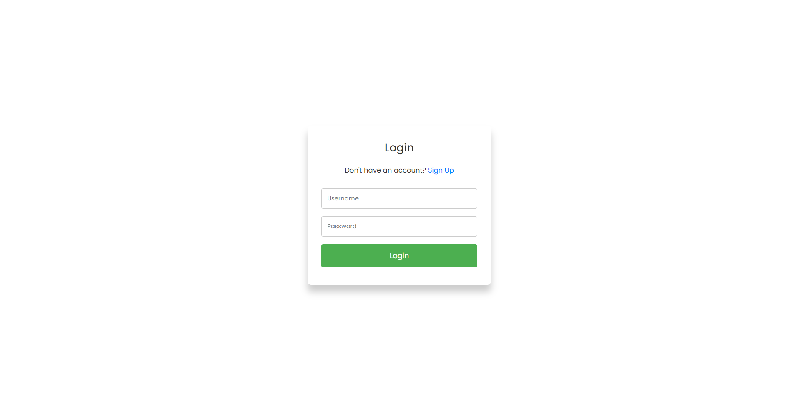
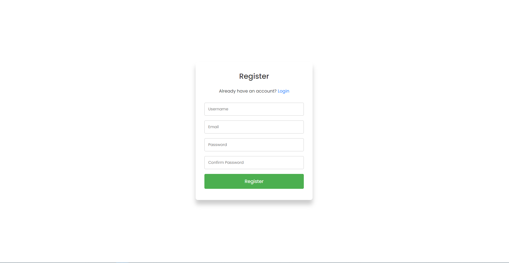
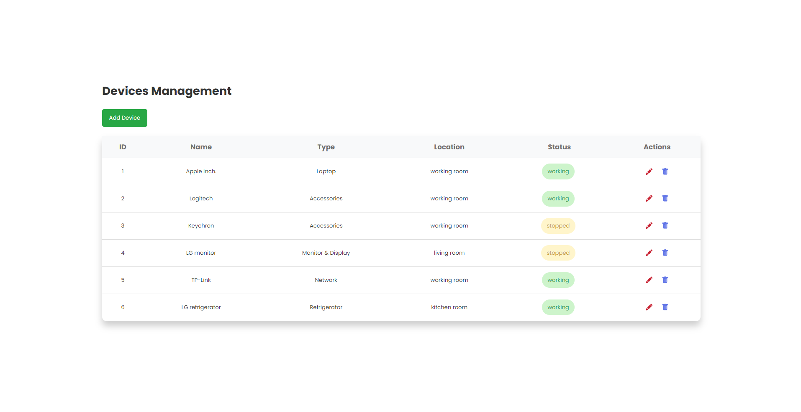
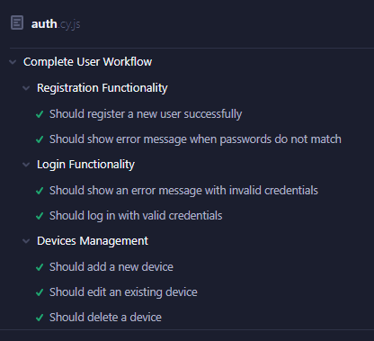
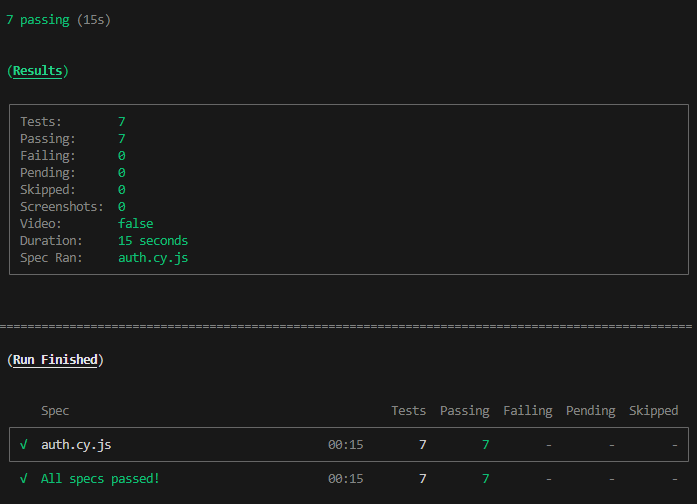
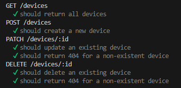

# Devices-Management

## Web Application Preview

#### Login page

#### Register page

#### Devices page

## Prerequisites

Before you start, make sure you have the following installed:

- [Docker](https://docs.docker.com/get-docker/)

## Installation

Clone the repository:
  ```bash
   git clone https://github.com/Robininyourarea/Devices-Management.git
   cd .\Devices-Management\
  ```

## Running the Application with Docker Compose
You have two options for running the application with Docker Compose: 
- Building the images from the Dockerfiles 
- Pulling the pre-built images from my DockerHub.


#### Option 1: Build Images Locally

##### 1.Run the following command to start the containers:

 ```bash
   docker-compose -f docker-compose-build.yaml up --build -d
  ```

This will build the images for the backend and frontend, then start the containers along with the MongoDB container.

##### 2.Access the application:

- Frontend: http://localhost:5173
- Backend API: http://localhost:5000

##### 3.To stop the containers:

```bash
   docker-compose -f docker-compose-build.yaml down
```

#### Option 2: Pull Pre-Built Images

If you prefer to pull pre-built images from Docker Hub, you can use the following instructions:

##### 1.Run the following command to start the containers:

 ```bash
   docker-compose -f docker-compose-pull.yaml up -d
 ```

This will pull the pre-built images for the backend and frontend from DockerHub and start the containers along with the MongoDB container.

##### 2.Access the application:

- Frontend: http://localhost:5173
- Backend API: http://localhost:5000

##### 3.To stop the containers:

```bash
   docker-compose -f docker-compose-pull.yaml down
```

## End-to-End Autonate Testing with Cypress result (Frontend test)

#### Result from Cypress UI



#### Result from terminal



## Unit testing server endpoint with Chai (Backend test)

#### Result from terminal


